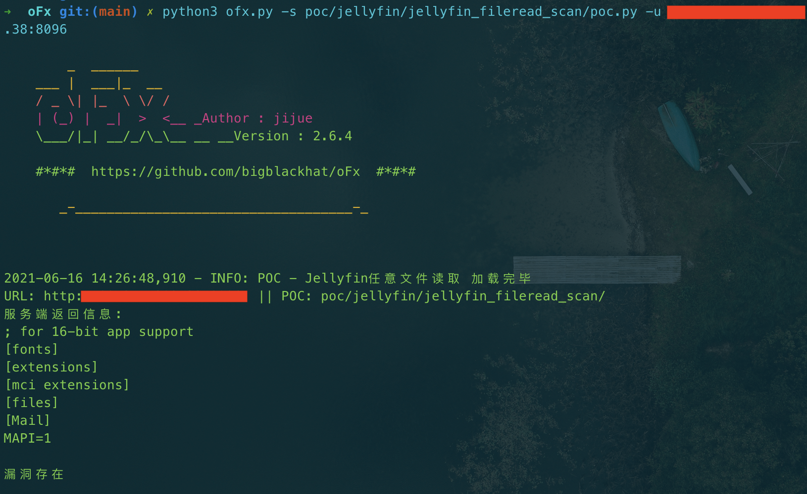
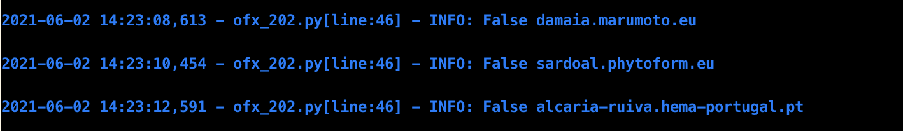
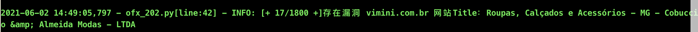
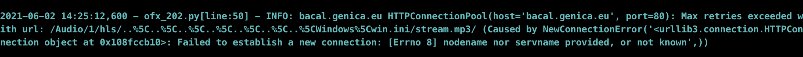

[](https://www.python.org/)

oFx是一个开源的、开箱即用的漏洞批量验证框架。无需任何编程基础，只需一条命令即可快速验证、扫描漏洞

## 🐈 项目优势

### 架构设计优势
1. 模块化设计：采用清晰的模块分离，核心组件低耦合高内聚 
2. 调度中心模式：通过 oFxCenter 统一管理扫描流程和资源调度 
3. 模板方法模式：POC 基类定义标准化接口，便于扩展和维护，详见: [POC编写规范及要求说明](https://github.com/bigblackhat/oFx/blob/main/docs/CODING.md)

### 核心技术创新
1. 智能代理池：自动筛选国内代理，动态测试和失效剔除机制 
2. 蜜罐检测：内置多种蜜罐特征库，基于HTTP响应内容分析，大幅降低误报率 
3. 全量POC扫描：接近专业漏洞扫描器功能，支持290+预置POC脚本，参见: [POC支持清单](https://github.com/bigblackhat/oFx/blob/main/docs/POCList.md)
4. Fofa API深度集成：支持多模式资产获取，智能去重和地域筛选

### 性能与扩展性
1. 高并发处理：支持自定义线程数，队列化管理避免资源浪费 
2. 标准化POC接口：统一的POC开发规范，便于社区贡献 
3. 多格式输出：支持TXT、Markdown、CSV、HTML等多种输出格式

### 用户体验优化
1. 简洁易用：命令行界面直观，参数设计合理 
2. 完善日志系统：分级日志管理，详细的漏洞发现记录 
3. 声音提醒：扫描完成时的声音提示功能 
4. 企业级特性：代理池支持避免IP封禁，适合大规模扫描

### 安全专业性
1. 高精度检测：严格的POC验证逻辑，避免误报 
2. 持续更新：POC库定期更新，覆盖最新漏洞，详见: [项目更新日志](https://github.com/bigblackhat/oFx/blob/main/docs/CHANGELOG.md)
3. 实战导向：针对实际安全测试场景设计，实用性极强

oFx的愿景在于将复杂的漏洞扫描工作标准化、流程化，让安全测试变得简单高效，是网络安全从业者的得力工具。

# ☕️ 使用方法

## 🚀 部署

```
git clone --depth 1 https://github.com/bigblackhat/oFx.git oFx
```

<br>

## 📋 使用前必读
⚠️ **重要提醒**

### 📁 输出文件管理
- oFx 每次运行都会在 `output/` 和 `log/` 文件夹下生成报告和日志
- **自动清理**：系统会自动删除12小时以前的报告和日志以节省存储空间
- **重要提示**：如果报告和日志对您有重要价值，请在运行结束后及时：
  - 将文件移出当前目录
  - 或重命名为中/英文形式

### 💻 系统兼容性
- ✅ **推荐系统**：Mac、Kali Linux、Windows
- ✅ **其他Linux发行版**：应该可以正常运行
- ❓ **Windows系统**：可能存在不可预测错误

---


## 🛵 单个url扫描模式

单个url扫描模式的使用场景：
> POC功能性测试

使用方法

```console
➜  oFx git:(main) ✗ python3 ofx.py -s poc/Jboss/Jboss_Unauthorized_access/poc.py -u xxx.xxx.xxx.xxx:xx
```

> 单个目标的漏洞验证详情(
> 返回取决于漏洞本身，目前所有POC都是为了批量验证而设计的，single检测模式尚没有对返回结果做优化，后续会有调整)



漏洞存在与否见最后一行

<br>
<br>

## ⭕漏洞利用

-e，写webshell、反弹shell等。

目前支持漏洞利用的POC：

```
禅道8.2-9.2.1注入GetShell       写Webshell
CVE-2024-36401 未授权RCE        反弹shell
Nacos未授权访问                  创建账户：crow/crow
```

由于笔者有选择困难症，还没想好漏洞利用功能的交互方式，暂时先这么用着吧

## 🚗 批量扫描模式

使用场景：

> 新漏洞爆出来做全网验证

> 刷CNVD之类的漏洞平台的积分或排名

> 有RCE漏洞的POC的话，就可以刷肉鸡(见下方的[POC支持清单](#PocSupport))

使用方法

```sh
➜  oFx git:(main) ✗ python3 ofx.py -s poc/Jboss/Jboss_Unauthorized_access/poc.py -f scan/jboss001.txt --thread 30
```

蓝字代表无漏洞  


绿字代表存在漏洞  


青字目标不可达  


也可以通过``,``分隔同时指定多个poc

```sh
➜  oFx git:(main) ✗ python3 ofx.py -s poc/Jboss/Jboss_Unauthorized_access/poc.py,poc/Jenkins/Unauth_Access_DashBoard/poc.py,poc/Alibaba_Druid/Unauth_Access_DashBoard/poc.py -f scan/jboss001.txt --thread 30
```

最后还可以通过``-s all``指定全量POC进行测试

```sh
➜  oFx git:(main) ✗ python3 ofx.py -s all -f scan/jboss001.txt --thread 50
```

全量POC下测试时常较久，建议食用方式：

* 根据自己电脑性能和带宽给到50个或更多的线程数
* 睡前开始扫描或出门玩儿之前打开oFx进行全量POC测试

偷偷说一句，因为全量POC测试是``依次运行所有POC对目标进行扫描``
，也就是只有一个POC扫完全部目标以后才会调用下一个POC，所以对每一个目标来说可能几十秒甚至几分钟内只有一次恶意请求（时长取决于资产数量和线程数），oFx本身不使用爬虫、fuzzing等技术，不会对被测资产产生任何负载压力，所以即使客户明令禁止使用漏扫，也可以放心大胆的用oFx哦

<br>
<br>

## 🚂 单个目标的全量POC测试

全量POC，顾名思义，遍历所有POC插件依次有序的对目标进行测试，接近于漏扫的概念，而且是一个专注于NDay的漏洞扫描器，因oFx的拓展性，非常适合手中掌握数量庞大的0Day的组织或个人（比如笔者自己），使得他可以将0Day库武器化。

没有被武器化的0Day库，就是一堆无用的文档和漏洞逻辑，没有哪个同行会一边读着上千份文档一边做渗透吧。

开始扫描：

```sh
# Single检测模式不支持全量POC，所以需要先将单个目标保存到文件中，再用批量扫描来扫描，算是曲线救国吧
# 单个或少于十个的目标就没有必要指定线程数了，因为默认线程数是10
echo http://xxx.xxx.com > scan/1.txt
python3 oFx.py -s all -f scan/1.txt
```

<br>
<br>

## 🐾 Fofa api 资产获取

通过fofa提供的api接口获取资产清单并去重


Fofa Search分成三种模式：  
1）默认模式，即：一条dork语句最大获取1w个资产  
2）自适应模式，即：根据fofa结果，自适应获取当前dork在全球保有量最多的5个国家与其5个行政区划的资产，理论上一条有效dork语句最多可以获得25w资产  
3）中国全境模式，即：根据中国全境行政区划（以Fofa官方设计为准），获取所有资产，理论上一条有效dork语句最多可以获得31w资产

fofa的配置文件位置为：``lib/fofa.ini``

```
备注：
每次运行fofa搜索功能时，oFx都会尝试登陆。
如果失败，会要求用户提供账号和key，此时再登陆成功，oFx会动态的修改配置文件中的user和key，无需打开配置文件调整，下次再使用时也直接生效不必重新输入user和key

在获取资产过程中，如果因报错中断或手动关闭程序，并不影响在此之前获取到的资产保存，可以根据  scan/运行fofa-search后指定的文件名.txt  去找。
```

<br>
<br>

## 🐾 Ceye配置

近期的版本更新中，oFx添加了对Ceye的支持，目前已有一部分POC采用了该平台来辅助漏洞检测，默认下载oFx之后不配置该项并不影响oFx正常的功能使用，只是相关的POC无法按照预期运行而已，有需要可以配置下：

```ini
; 在位于项目根目录下的lib/ceye.ini文件中修改dns和token两项的值
[ceye]
; 从ceye中拿到以下的数据，缺一不可
dns = xxxxxx.ceye.io

token = xxxxxxxxxxxxxxxxxxxxxxxxxxxxxxxx
```

<br>

## 代理

设置代理需要使用`--proxy`参数。

http代理：`--proxy http://1.1.1.1:8080`

socks5代理：`--proxy socks5://1.1.1.1:1234`

### 💦 proxypool

近期的版本更新中，oFx提供了对proxypool的支持，proxypool是个http代理池工具，原本定位是用于爬虫使用，防止同一个ip访问次数过多被封ip，该功能也适用于我们漏扫场景，当我们对同一个站点或同一个单位的资产进行一定数量的扫描时，有极大的概率会被封。

proxypool本身有11个免费代理源，程序运行起来以后会定时采集免费代理并验证代理的可用性，同时可以由用户自己添加代理源以提高代理的数量和质量。

项目地址：https://github.com/jhao104/proxy_pool

使用方法：  
proxypool的使用方法可以参考项目文档，oFx与其对接的原理就是访问http://127.0.0.1:5000的api接口，有特殊需要可以自行调整

下面仅描述本地启动proxypool并运行oFx与其对接的方法。

1.下载项目

```shell
git clone git@github.com:jhao104/proxy_pool.git
```

2.安装依赖

```shell
pip install -r requirements.txt
```

3.安装redis，然后修改api与数据库配置

```python
# setting.py 为项目配置文件

# 配置API服务

HOST = "0.0.0.0"  # IP
PORT = 5000  # 监听端口

# 配置数据库

DB_CONN = 'redis://:@127.0.0.1:8888/0'

# 配置 ProxyFetcher

PROXY_FETCHER = [
    "freeProxy01",  # 这里是启用的代理抓取方法名，所有fetch方法位于fetcher/proxyFetcher.py
    "freeProxy02",
    # ....
]

# proxyCheck时代理数量少于POOL_SIZE_MIN触发抓取
POOL_SIZE_MIN = 50  # 这里笔者觉得50会好一点
```

4.启动proxypool

```shell
# 如果已经具备运行条件, 可用通过proxyPool.py启动。
# 程序分为: schedule 调度程序 和 server Api服务

# 启动调度程序
python proxyPool.py schedule

# 启动webApi服务
python proxyPool.py server

```

5.oFx对接proxypool

直接在后面跟上``--proxypool``参数即可。

```shell
python3 ofx.py -s all -f xxx.txt --proxypool --thread 50
```

此时oFx就会通过proxypool的api接口获取一个代理，然后判断：

* 如果是国外的代理，就会抛弃并删除该代理，然后重新获取。
* 如果是国内代理，就会尝试进行访问测试，如果失败，同样抛弃并删除，但如果测试成功，则会引用该代理。


<br>
<br>

# 🚔 法律免责声明

本工具仅面向合法授权的企业安全建设行为，如您需要测试本工具的可用性，请自行搭建靶机环境。

为避免被恶意使用，本项目所有收录的poc均为漏洞的理论判断，不存在漏洞利用过程，不会对目标发起真实攻击和漏洞利用。

在使用本工具进行检测时，您应确保该行为符合当地的法律法规，并且已经取得了足够的授权。请勿对非授权目标进行扫描。

如您在使用本工具的过程中存在任何非法行为，您需自行承担相应后果，我们将不承担任何法律及连带责任。

在安装并使用本工具前，请您务必审慎阅读、充分理解各条款内容，限制、免责条款或者其他涉及您重大权益的条款可能会以加粗、加下划线等形式提示您重点注意。

除非您已充分阅读、完全理解并接受本协议所有条款，否则，请您不要安装并使用本工具。您的使用行为或者您以其他任何明示或者默示方式表示接受本协议的，即视为您已阅读并同意本协议的约束。

# 📜 Licenses

在原有协议LICENSE中追加以下免责声明。若与原有协议冲突均以免责声明为准。

本工具禁止进行未授权商业用途，禁止二次开发后进行未授权商业用途。

本工具仅面向合法授权的企业安全建设行为，在使用本工具进行检测时，您应确保该行为符合当地的法律法规，并且已经取得了足够的授权。

如您在使用本工具的过程中存在任何非法行为，您需自行承担相应后果，我们将不承担任何法律及连带责任。

在使用本工具前，请您务必审慎阅读、充分理解各条款内容，限制、免责条款或者其他涉及您重大权益的条款可能会以加粗、加下划线等形式提示您重点注意。
除非您已充分阅读、完全理解并接受本协议所有条款，否则，请您不要使用本工具。您的使用行为或者您以其他任何明示或者默示方式表示接受本协议的，即视为您已阅读并同意本协议的约束。

# 😄 致谢JetBrains

``oFx``项目一直以来都是在 ``JetBrains`` 公司旗下的``PyCharm``集成开发环境中进行开发，基于 free JetBrains Open Source
license(s) 正版免费授权，在此表达我的谢意。


[//]: # (~~都看到这儿了，点个star再走呗~~)

[//]: # ()
[//]: # (![show]&#40;img/006.jpg&#41;)

Star统计  

[](https://starchart.cc/bigblackhat/oFx)