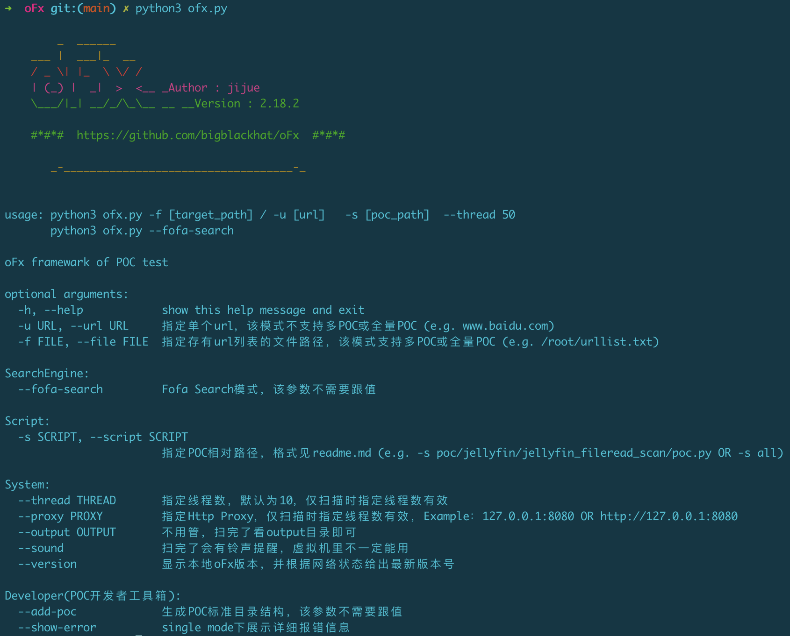
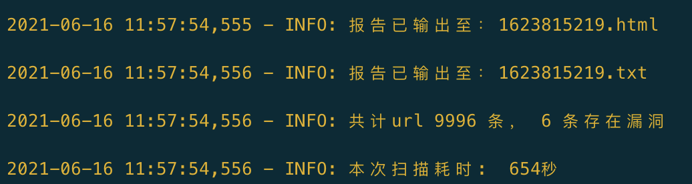

# oFx


[](https://www.python.org/)  [](https://github.com/bigblackhat/oFx/blob/main/LICENSE)

## 简介
``中文名：奥夫叉(谐音哈哈🦉)``  

一个应用于web安全领域的漏洞扫描框架，可被应用于但不限于如下场景：
```
0Day/1Day全网概念验证(在没有懒得测试环境的情况下，直接写POC全网扫描，亲测很爽)

刷肉鸡(需要使用RCE/写文件等漏洞的POC)    

企业内网或对外开放资产的安全评估  

简单的拒绝服务攻击(用Url存活检测POC)
```

虽说是框架，但目前的规模仅是笔者自用及与身边小伙伴分享的工具  

#### Legal Disclaimer
```
Usage of oFx for attacking targets without prior mutual consent is illegal.
oFx is for security testing purposes only
```

#### 法律免责声明
```
未经事先双方同意，使用oFx攻击目标是非法的。
oFx仅用于安全测试与研究目的
```




黑底蓝字代表无漏洞  


黑底绿字代表存在漏洞  


黑底青字目标不可达  


网速尚可情况下，测试30个线程的速度：

Fofa会员一条搜索语句能提取一万条url，约11分钟跑完  


## 使用方法  


### 部署

```
git clone --depth 1 https://github.com/bigblackhat/oFx.git oFx
```

### 用前提醒
使用前提醒，oFx默认每次运行都会有报告和log的输出，分别在output和log文件夹下，出于缓解存储压力的考虑，笔者设定的规则为每次运行时都会删除12小时以前的输出文件，如果该输出文件对使用者有剩余价值，请在运行结束后及时将输出文件移出当前目录或更名为中/英文形式，如果有重要信息被删除，就再扫一遍吧，也快得很  

另外，oFx如今可以良好的运行于Mac和Kali系统，相信其他linux也可以正常运行，但由于笔者没有Windows测试环境，因此在Windows上运行oFx可能会发生一些不可预测的错误，请避免在Windows上运行oFx  

### 单个url扫描模式

单个url扫描模式的使用场景：
> POC功能性测试

使用方法  
```sh
➜  oFx git:(main) ✗ python3 ofx.py -s poc/Jboss/Jboss_Unauthorized_access/poc.py -u xxx.xxx.xxx.xxx:xx
```
> 单个目标的漏洞验证详情(返回取决于漏洞本身，目前所有POC都是为了批量验证而设计的，single检测模式尚没有对返回结果做优化，后续会有调整)  


漏洞存在与否见最后一行  

### 批量扫描模式

使用场景：  

> 新漏洞爆出来做全网验证  

> 刷CNVD之类的漏洞平台的积分或排名  

> 有RCE漏洞的POC的话，就可以刷肉鸡(见下方的[POC支持清单](#PocSupport))  

使用方法  
```sh
➜  oFx git:(main) ✗ python3 ofx.py -s poc/Jboss/Jboss_Unauthorized_access/poc.py -f scan/jboss001.txt --thread 30
```
也可以通过``,``分隔同时指定多个poc
```sh
➜  oFx git:(main) ✗ python3 ofx.py -s poc/Jboss/Jboss_Unauthorized_access/poc.py,poc/Jenkins/Unauth_Access/poc.py,poc/Alibaba_Druid/Unauth_Access/poc.py -f scan/jboss001.txt --thread 30
```
最后还可以通过``-s all``指定全量POC进行测试
```sh
➜  oFx git:(main) ✗ python3 ofx.py -s all -f scan/jboss001.txt --thread 50
```
全量POC下测试时常较久，建议食用方式：
* 根据自己电脑性能和带宽给到50个或更多的线程数  
* 睡前开始扫描或出门玩儿之前打开oFx进行全量POC测试  

### 单个目标的全量POC测试

全量POC，顾名思义，遍历所有POC插件依次有序的对目标进行测试，接近于漏扫的概念，而且是一个专注于NDay的漏洞扫描器，因oFx的拓展性，非常适合手中掌握数量庞大的0Day的组织或个人（比如笔者自己），使得他可以将0Day库武器化。  

没有被武器化的0Day库，就是一堆无用的文档和逻辑，没有哪个黑客会一边读着上千份文档一边日站吧。   

开始扫描：
```sh
# Single检测模式不支持全量POC，所以需要先将单个目标保存到文件中，再用批量扫描来扫描，算是曲线救国吧
# 单个或少于十个的目标就没有必要指定线程数了，因为默认线程数是10
echo http://xxx.xxx.com > scan/1.txt
python3 oFx.py -s all -f scan/1.txt
```


### Fofa api 资产获取

通过fofa提供的api接口获取资产清单  


```sh
➜  oFx git:(main) ✗ python3 ofx.py --fofa-search

20xx-xx-xx xx:xx:xx,xxx - INFO: User : xxx@163.com | Key : xxx | 登陆成功
请输入结果保存文件名(不必加文件后缀)：jboss001
请输入搜索语句：app="Jboss"

20xx-xx-xx xx:xx:xx,xxx - INFO: Fofa搜索语句为：app="Jboss"，开始与Fofa Api对接
第1页获取成功
第2页获取成功
第3页获取成功
...
第99页获取成功
第100页获取成功

20xx-xx-xx xx:xx:xx,xxx - INFO: 搜索完毕，结果保存至/root/oFx/scan/jboss001.txt，经去重共计9748条
```

可以动态的修改user和key，无需打开配置文件调整，下次使用时直接生效不必重新输入user和key    

fofa search模式会将从api中获取到的结果进行去重并重新排序，因此虽然笔者设定逻辑为获取一万条url但大部分情况下都不会是正好一万条结果，请放心食用  

## POC支持清单<div id="PocSupport"></div>

<br>

oFx目前仅具备verify也就是漏洞识别的能力，并不负责漏洞的后续利用，以下漏洞目前已支持检测  

<br>


|应用|漏洞名称|POC路径|
|-|-|-|
|360|360天擎数据库未授权访问|``poc/360/TianQing_Unauth_Acceess/poc.py``|
|Alibaba_Druid|Druid未授权访问|``poc/Alibaba_Druid/Unauth_Access/poc.py``|
|Alibaba_Nacos|Nacos未授权访问|``poc/Alibaba_Nacos/Unauth_Access/poc.py``|
|Apache CouchDB|Apache Couchdb 远程权限提升 (CVE-2017-12635)|``poc/Apache_CouchDB/Priv_Escalation_CVE-2017-12635/poc.py``|
|Apache Flink|Apache Flink目录穿透 (CVE-2020-17519)|``poc/Apache_Flink/Dir_Traversal_CVE_2020_17519/poc.py``|
|Apache Solr|Apache Solr 任意文件读取漏洞|``poc/Apache_Solr/File_Read/poc.py``|
|碧海威 L7|碧海威 L7 弱口令漏洞|``poc/Bithighway_碧海威/Weak_Pass_L7/poc.py``|
|C-Lodop|C-Lodop 云打印机系统平台任意文件读取漏洞|``poc/C_Lodop/File_Read/poc.py``|
|中国电信|电信天翼网关F460 web_shell_cmd.gch 远程命令执行漏洞|``poc/China_TeleCOM_中国电信/RCE_F460_GateWay/poc.py``|
||大唐电信AC集中管理平台默认口令|``poc/China_TeleCOM_中国电信/Weak_Pass_DaTang_AC_Manager/poc.py``|
|中国移动|中国移动 禹路由 ExportSettings.sh 敏感信息泄露漏洞|``poc/China_Mobile_中国移动/Info_Disclosure_Yu_routing_ExportSettings/poc.py``|
|common(通用)|git信息泄露|``poc/common/Git_Info_Disclosure/poc.py``|
||svn信息泄露|``poc/common/Svn_Info_Disclosure/poc.py``|
||URL存活检测|``poc/common/Url_Alive/poc.py``|
|Coremail|Coremail 配置信息泄露漏洞|``poc/Coremail/Conf_Info_Disclosure/poc.py``|
|赤兔CMS|赤兔CMS banner识别插件|``poc/CtCMS_赤兔CMS/Get_Banner/poc.py``|
|D-Link|D-Link ShareCenter DNS-320 system_mgr.cgi 远程命令执行漏洞|``poc/D_Link/RCE_system_mgr_ShareCenter/poc.py``|
|DVR|DVR登录绕过漏洞|``poc/DVR/Login_Bypass/poc.py``|
|ElasticSearch|ElasticSearch 未授权访问|``poc/Elasticsearch/Unauth_Access/poc.py``|
||ElasticSearch 命令执行漏洞（CVE-2014-3120）|``poc/Elasticsearch/Cmd_Exec_MVEL_CVE-2014-3120/poc.py``|
||ElasticSearch Groovy 沙盒绕过 && 代码执行漏洞（CVE-2015-1427）|``poc/Elasticsearch/Code_Exec_Groovy_CVE-2015-1427/poc.py``|
||ElasticSearch 目录穿越漏洞（CVE-2015-5531）|``poc/Elasticsearch/Dir_Traversal_CVE-2015-5531/poc.py``|
||Elasticsearch写任意文件漏洞（WooYun-2015-110216）|``poc/Elasticsearch/File_Create_WooYun-2015-110216/poc.py``|
|Eyou 亿邮电子邮件系统|亿邮电子邮件系统 远程命令执行|``poc/Eyou_亿邮/RCE_moni_detail/poc.py``|
|F5|F5 BIG-IP任意文件读取(CVE-2020-5902)|``poc/F5_BIG_IP/File_Read_CVE_2020_5902/poc.py``|
|H3C SecPath 下一代防火墙|H3C SecPath 下一代防火墙 任意文件下载漏洞|``poc/H3C/File_Download_SecPath_WAF/poc.py``|
|海康威视|HIKVISION 视频编码设备接入网关 任意文件下载|``poc/HIKVISION/File_Down_Gateway_downFile_php/poc.py``|
||HIKVISION 流媒体管理服务器弱口令|``poc/HIKVISION/Weak_Pass_Stream_Media_Manager/poc.py``|
||HIKVISION 流媒体管理服务器任意文件读取|``poc/HIKVISION/File_Read_Stream_Media_Manager/poc.py``|
|宏电|宏电 H8922 后台任意文件读取漏洞|``poc/Hongdian_宏电/Backstage_File_Read_CVE_2021_28152/poc.py``|
|华为|Huawei HG659 lib 任意文件读取漏洞|``poc/Huawei/File_Read_HG659_lib/poc.py``|
|汇文|汇文OPAC敏感信息泄露|``poc/HuiWen_汇文/Info_Disclosure/poc.py``|
||汇文OPAC弱口令|``poc/HuiWen_汇文/Weak_Pass/poc.py``|
|Jboss|Jboss未授权访问|``poc/Jboss/Unauth_Access/poc.py``|
|Jellyfin|Jellyfin任意文件读取|``poc/jellyfin/File_Read_CVE_2021_21402/poc.py``|
|Jenkins|Jenkins未授权访问|``poc/Jenkins/Unauth_Access/poc.py``|
|金和OA|金和OA C6 download.jsp 任意文件读取漏洞|``poc/Jinher_金和OA/File_Read_download_jsp/poc.py``|
|KEDACOM 数字系统接入网关|KEDACOM 数字系统接入网关 任意文件读取漏洞|``poc/KEDACOM_数字系统接入网关/File_Read/poc.py``|
|金蝶OA|金蝶协同办公系统 任意文件下载漏洞|``poc/Kingdee_金蝶/File_Down_fileDownload_do/poc.py``|
|Kyan网络监控设备|Kyan网络监控设备信息泄露|``poc/Kyan/Info_Disclosure/poc.py``|
|蓝凌OA|蓝凌OA前台任意文件读取漏洞|``poc/Landray_蓝凌OA/File_Read_CNVD_2021_28277/poc.py``|
|Laravel Framework|Laravel .env 配置文件泄露|``poc/Laravel_Framework/Conf_Info_Disclosure_dot_env/poc.py``|
|朗驰欣创|朗驰欣创视频监控系统 FTP账号密码泄露|``poc/LinkSeek_朗驰欣创/FTP_Account_Info_Disclosure/poc.py``|
|利谱第二代防火墙|利谱第二代防火墙存在信息泄露漏洞|``poc/LiPu_利谱第二代防火墙/Info_Disclosure/poc.py``|
|佑友|佑友防火墙 弱口令|``poc/MailGard_佑友/Weak_Pass_FireWall/poc.py``|
||佑友防火墙 后台命令执行漏洞|``poc/MailGard_佑友/RCE_ping_FireWall/poc.py``|
|迈普 ISG1000安全网关|迈普 ISG1000安全网关 任意文件下载漏洞|``poc/MaiPu_迈普/File_Download_webui/poc.py``|
|MessageSolution企业邮件归档管理系统|MessageSolution企业邮件归档管理系统 EEA 信息泄露|``poc/MessageSolution/Info_Disclosure/poc.py``|
|Node.js|Node.js目录穿越漏洞|``poc/Node.js/Dir_Traversal_CVE_2017_14849/poc.py``|
|梨子项目管理系统|梨子项目管理系统 信息泄露漏洞|``poc/PearProject_梨子项目管理系统/Conf_Info_Disclosure_env/poc.py``|
|PHP|php v8.1开发版后门检测|``poc/php/Backdoor_v8dev/poc.py``|
|PHPUnit|PHPUnit eval-stdin.php 远程命令执行漏洞|``poc/PHPUnit/RCE_eval_stdin/poc.py``|
|Redis|Redis未授权访问|``poc/Redis/Unauth_Access/poc.py``|
|锐捷|锐捷EG网关 userAuth.php存在任意文件读取漏洞|``poc/Ruijie_锐捷/File_Read_EG_userAuth/poc.py``|
||锐捷NBRNBR1300G 路由器 越权CLI命令执行漏洞|``poc/Ruijie_锐捷/RCE_NBR_1300G/poc.py``|
||锐捷NBR路由器 EWEB网管系统 远程命令执行漏洞|``poc/Ruijie_锐捷/RCE_EWEB_Manager_CNVD_2021_09650/poc.py``|
||锐捷RG-UAC/RG-ISG统一上网行为管理审计系统存在账号密码信息泄露|``poc/Ruijie_锐捷/UPInfo_DisClosure_RG_UAC_CNVD_2021_14536/poc.py``|
||锐捷Smartweb管理系统 默认账户➕命令执行漏洞|``poc/Ruijie_锐捷/RCE_SmartWeb_WEB_VMS/poc.py``|
||锐捷云课堂主机 目录遍历漏洞|``poc/Ruijie_锐捷/Dir_List_Cloud_ClassRoom/poc.py``|
|Samsung|三星路由器本地文件包含|``poc/Samsung/Lfi_Samsung_Wlan_AP/poc.py``|
||三星 WLAN AP WEA453e路由器 远程命令执行漏洞|``poc/Samsung/RCE_Samsung_WLANAP_WEA453e/poc.py``|
|SonarQube|SonarQube api 信息泄露漏洞|``poc/SonarQube/Info_Disclosure_CVE_2020_27986/poc.py``|
|SonicWall SSL-VPN|SonicWall SSL-VPN 远程命令执行漏洞|``poc/SonicWall_SSL_VPN/RCE_jarrewrite/poc.py``|
|TamronOS IPTV系统|TamronOS IPTV系统 后台配置敏感信息|``poc/TamronOS_IPTV/Info_Disclosure/poc.py``|
||TamronOS IPTV系统存在前台命令执行漏洞|``poc/TamronOS_IPTV/RCE_api_ping/poc.py``|
||TamronOS IPTV系统 submit 任意用户创建漏洞|``poc/TamronOS_IPTV/User_Add_Submit/poc.py``|
|泛微 OA|泛微云桥 e-Bridge 任意文件读取漏洞|``poc/Weaver_泛微OA/File_Read_E_Bridge/poc.py``|
||泛微 OA 8 前台SQL注入|``poc/Weaver_泛微OA/Sql_inj_E_cology_V8/poc.py``|
|Weblogic|Weblogic SSRF (CVE-2014-4210)|``poc/Weblogic/CVE_2014_4210/poc.py``|
|用友NC|用友NC6.5 BeanShell RCE|``poc/Yonyou_用友NC/RCE_BeanShell_CNVD_2021_30167/poc.py``|
||用友ERP-NC 目录遍历漏洞|``poc/Yonyou_用友NC/Dir_List_ERP/poc.py``|
|ZeroShell防火墙|ZeroShell 3.9.0 远程命令执行漏洞|``poc/ZeroShell/RCE_kerbynet/poc.py``|

## 致谢清单

以下清单中的项目笔者都有参考或对笔者提供一定程度上的帮助，排名不分先后顺序，仅按照中文全拼首字母顺序排列  

|项目地址|
|-|
|[AngelSword](https://github.com/Lucifer1993/AngelSword)|
|[edusrc_POC](https://github.com/Cl0udG0d/edusrc_POC)|
|[pocsuite3](https://github.com/knownsec/pocsuite3)|
|[sqlmap](https://github.com/sqlmapproject/sqlmap) sqlmap永远滴神|
|[vulhub](https://vulhub.org/)|


<br>
<br>
<br>


## 错误提交

如果您在使用oFx的过程中遇到了一些笔者写代码时没有考虑到的问题或没有测试到的错误，欢迎通过邮箱告知笔者(ronginus@qq.com)或提Issues  

提交BUG时，需要给到笔者触发错误的oFx命令，测试文件，您的运行环境（包括但不限于操作系统、python版本等），报错的字符串形式➕报错截图  


~~都看到这儿了，点个star再走呗~~


<br>
<br>
<br>
<br>
<br>
<br>
<br>
<br>
<br>
<br>
<br>
<br>
<br>
<br>
<br>
<br>
<br>
<br>
<br>
<br>
<br>
<br>
<br>
<br>
<br>
<br>
<br>
<br>
<br>
<br>
<br>
<br>
<br>
<br>
<br>
<br>
<br>
<br>
<br>
<br>
<br>
<br>
<br>
<br>
<br>
<br>
<br>
<br>
<br>
<br>
<br>
<br>
<br>
<br>
<br>
<br>
<br>
<br>
<br>
<br>
<br>
<br>
<br>
<br>
<br>
<br>
<br>
<br>
<br>
<br>
<br>
<br>
<br>
<br>
<br>
<br>
<br>
<br>
<br>
<br>
<br>
<br>
<br>
<br>
<br>
<br>
<br>
<br>
<br>
<br>
<br>
<br>
<br>
<br>
<br>
<br>
<br>
<br>
<br>
<br>
<br>
<br>
<br>
<br>
<br>
<br>
<br>
<br>
<br>
<br>
<br>
<br>
<br>
<br>
<br>
<br>
<br>
<br>
<br>
<br>
<br>
<br>
<br>
<br>
<br>
<br>
<br>
<br>
<br>
<br>
<br>
<br>
<br>
<br>
<br>
<br>
<br>
<br>
<br>
<br>
<br>
<br>
<br>
<br>
<br>
<br>
<br>
<br>
<br>
<br>
<br>
<br>
<br>
<br>
<br>
<br>
<br>
<br>
<br>
<br>
<br>
<br>
<br>
<br>
<br>
<br>
<br>
<br>
<br>
<br>
<br>
<br>
<br>
<br>
<br>
<br>
<br>
<br>
<br>
<br>
<br>
<br>
<br>
<br>
<br>
<br>
<br>
<br>
<br>
<br>
<br>
<br>
<br>
<br>
<br>
<br>
<br>
<br>
<br>
<br>
<br>
<br>
<br>
<br>
<br>
<br>
<br>
<br>
<br>
<br>
<br>
<br>
<br>
<br>
<br>
<br>
<br>
<br>
<br>
<br>
<br>
<br>
<br>
<br>
<br>
<br>
<br>
<br>
<br>
<br>
<br>
<br>
<br>
<br>
<br>
<br>
<br>
<br>
<br>
<br>
<br>
<br>
<br>
<br>
<br>
<br>
<br>
<br>
<br>
<br>
<br>
<br>
<br>
<br>
<br>
<br>
<br>
<br>
<br>
<br>
<br>
<br>
<br>
<br>
<br>
<br>
<br>
<br>
<br>
<br>
<br>

写一个好玩且能用的漏扫类的工具是我一直以来的执念，虽然离好用且完美还很远  

感谢我的领导(id:``张真人``)给予我时间去自由探索，他也提出了很多前瞻性的idea（比如全量POC模式）

感谢我的同事(id:``hansi``)利用闲暇之余完成的POC贡献（见``changelog.md``）与前期使用体验的反馈  

写oFx之前我的愿景是写一个概念验证工具，在hw等特殊时期网络上会充斥许许多多真真假假的漏洞，如何能仅根据语焉不详的利用描述就写出一个批量验证工具且具备无限的拓展性和复用性，根据这一需求，oFx的初代版本就这样诞生了，随着全量POC功能的实现，oFx更像一个专注于Nday检测的漏扫了，甚至可以用RCE漏洞去全网刷肉鸡(我也确实是这样描述oFx的)，但我仍希望大家能用它来做安全研究工作

接下来的时光我将会沉浸于代码审计的工作，oFx的架构不会有明显的调整，但POC应该会持续的不定期的更新  

出于对萌新使用体验的考虑，我会将核心的输出信息更为中文   

感谢读到这里，祝好祝顺  

``访客数统计``
