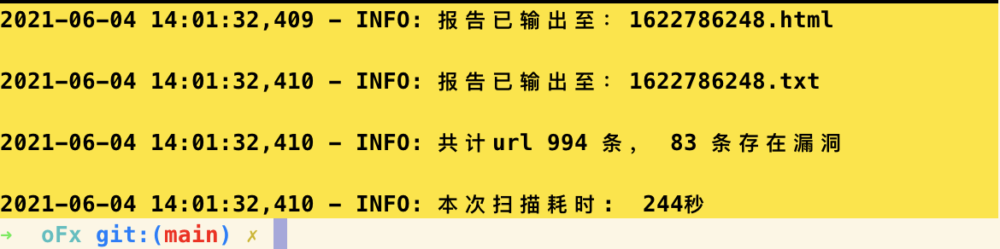
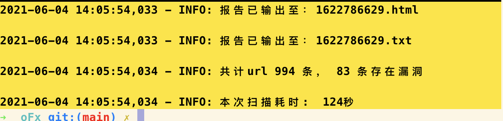
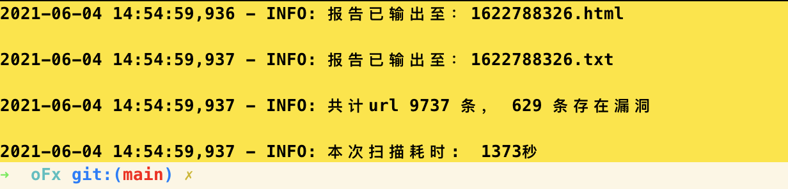
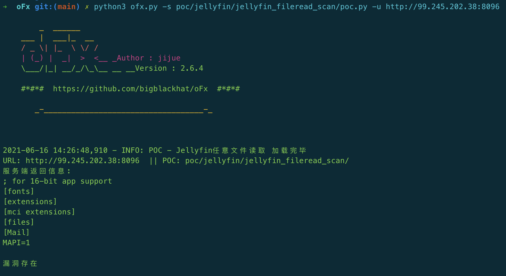
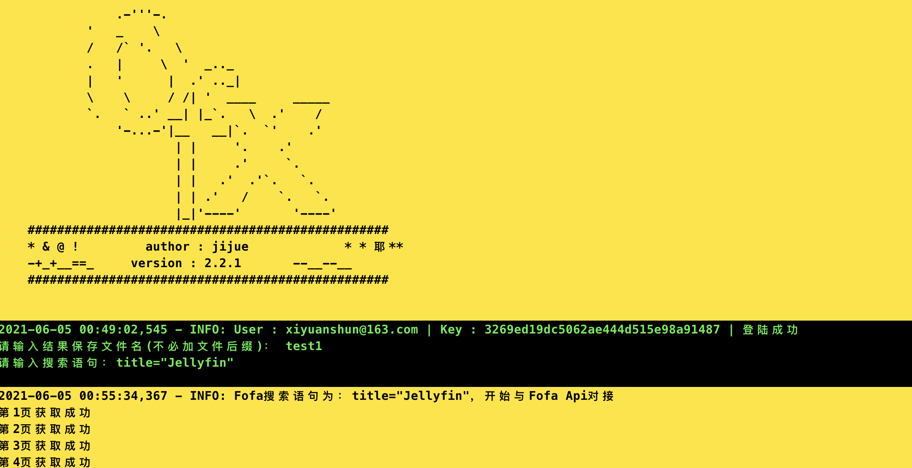

# oFx

## 简介
一个应用于web安全领域的漏洞扫描框架，刷洞，刷肉鸡用（取决于你的漏洞）  

虽说是框架，但目前的规模仅是笔者自用及与身边小伙伴分享的工具  

黑底蓝字代表无漏洞  

黑底绿字代表存在漏洞  

黑底青字目标不可达  

网速尚可情况下，测试10个线程的速度：

也就是4分钟1000条  

网速尚可情况下，测试20个线程的速度：

两分钟跑完1000条  

网速尚可情况下，测试25个线程的速度：

约22分钟跑完一万条  

## 使用方法  

### 单个url扫描模式

单个url扫描模式的使用场景：
> POC功能性测试

> 单个目标的漏洞验证详情(取决于POC)  

### 批量扫描模式

使用场景：  

> 新漏洞爆出来做全网验证  

> 刷CNVD之类的漏洞平台的积分或排名  

> 有RCE漏洞的POC的话，就可以刷肉鸡  

### fofa api 资产获取

通过fofa提供的api接口获取资产清单  

可以动态的修改user和key，无需打开配置文件调整，下次使用时直接生效不必重新输入user和key    

## 致谢清单

以下清单中的项目笔者都有参考，排名不分先后顺序，仅按照中文全拼首字母顺序排列  

|项目地址|
|-|
|[sqlmap]()|
|[pocsuite3]()|

TODO  
~~插件调用~~  
~~html报告导出~~  
~~log记录与打印~~   
~~多线程~~   
~~添加启动时环境监测机制~~    
~~添加系统目录初始化操作~~  
~~添加系统参数初始化操作~~  
~~调整模块导入细节~~   
~~加入计时功能~~  
poc全面拥抱urllib2  
~~插件模版制作~~  
~~添加按键退出功能~~    
~~添加fofa-api接口~~   
html报告版面优化，参考pocsuite3/plugins/html_report.py  
添加自动更新功能，该功能放弃广大win用户，请见谅，参考pocsuite3/lib/core/update.py  